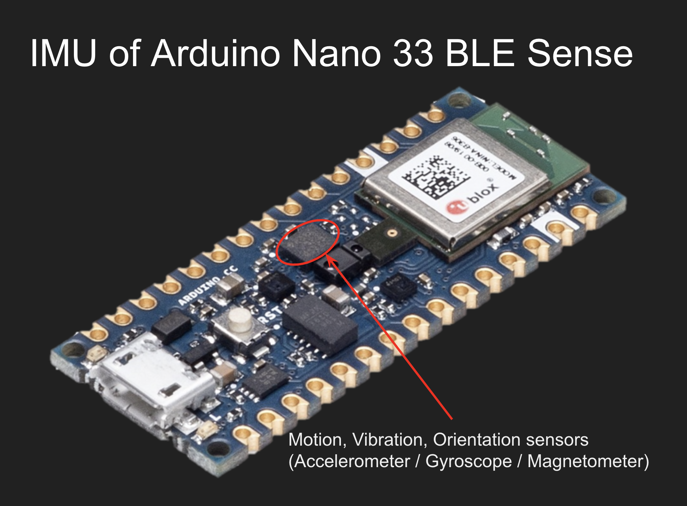
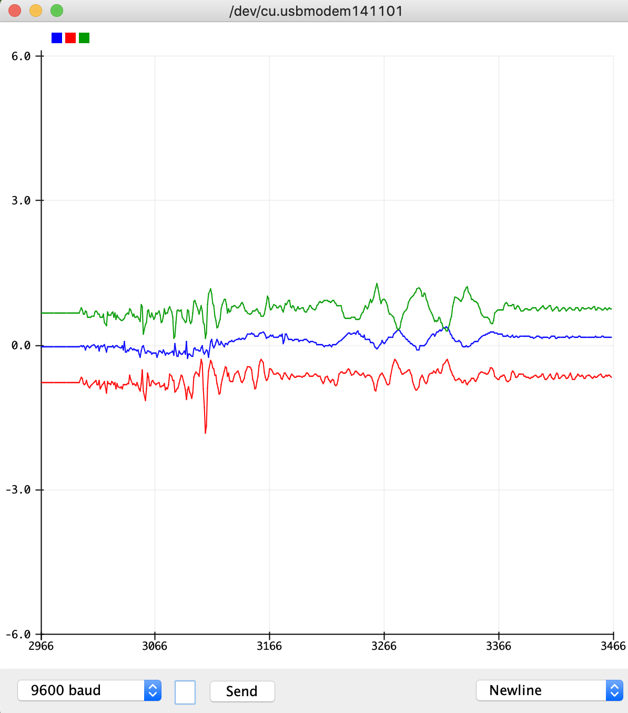
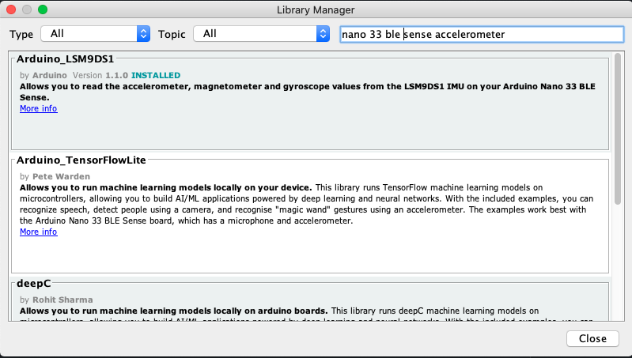
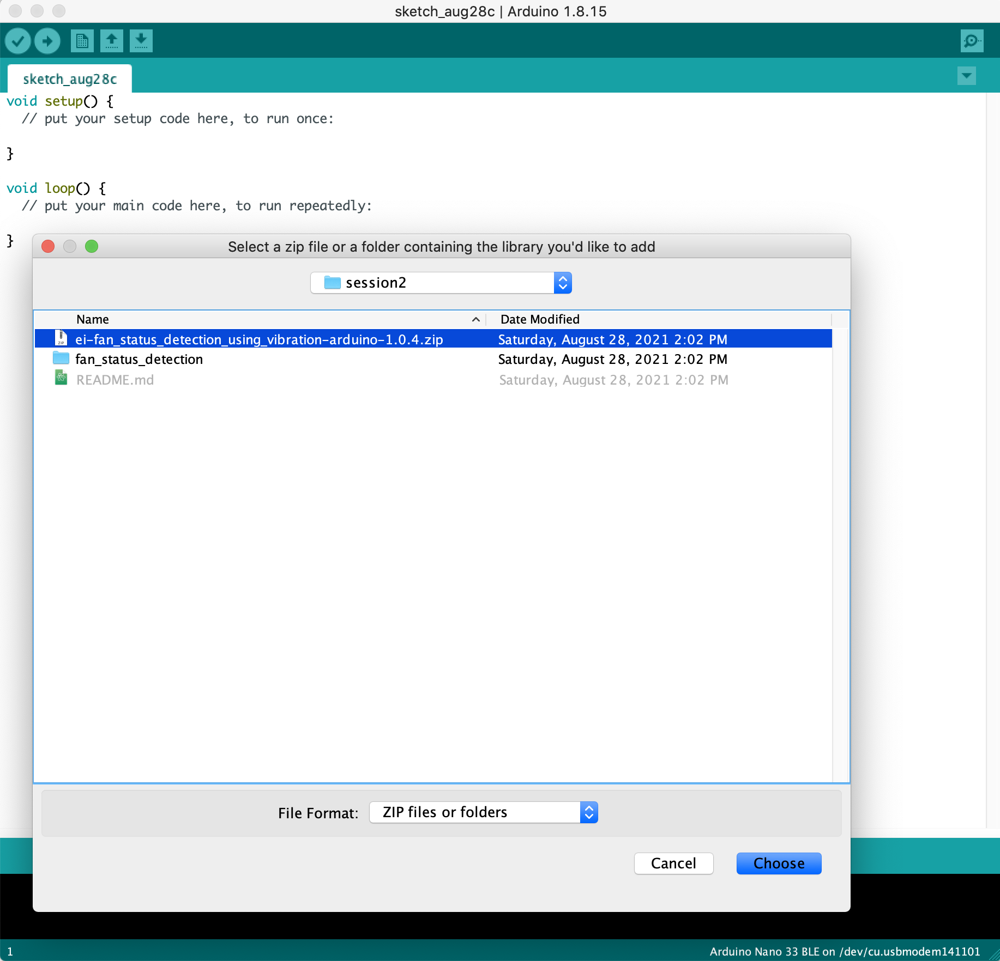
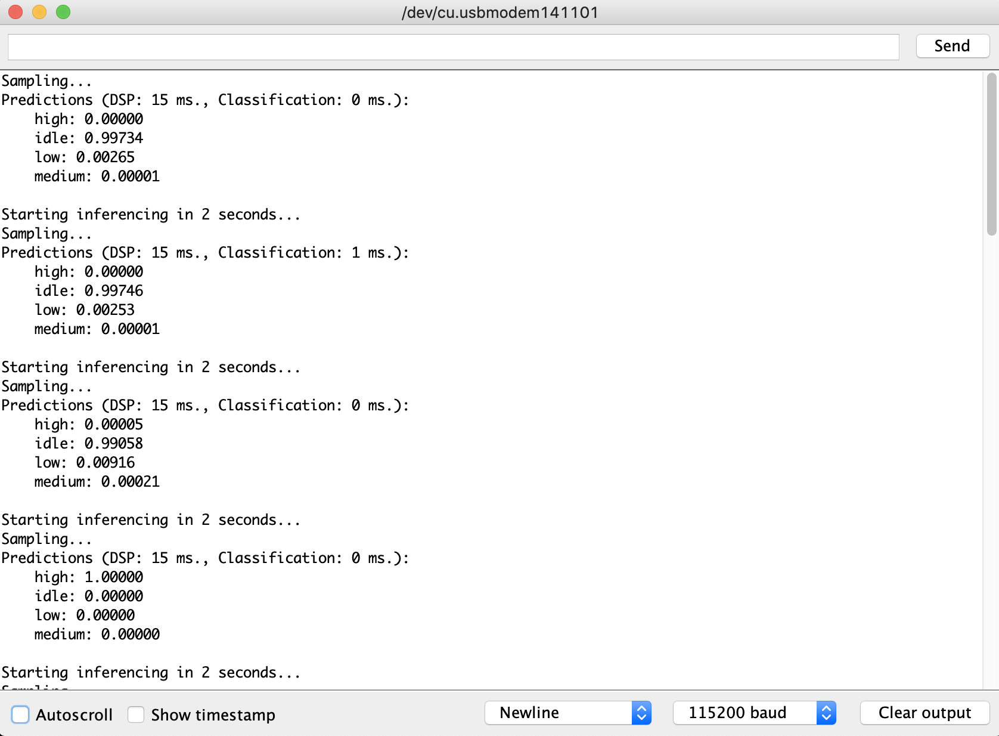

# Motion Based Application using IMU
Our second session of the EdgeAI Lab with Microcontroller Series is to show how to develop a simple Motion Based application using the IMU device on Arduino Nano 33 BLE Sense board. 

# What is IMU
IMU stands for inertial measurement unit. It is an electronic device that measures and reports a body's specific force, angular rate and the orientation of the body, using a combination of accelerometers, gyroscopes, and oftentimes magnetometers.


A simple tutorial to [Access IMU Data on Arduino Nano 33 BLE Sense Board](https://docs.arduino.cc/tutorials/nano-33-ble-sense/imu_accelerometer).

A quick clip code to visualize your data on Arduino Serial Plotter.
```
void loop() {
  if (IMU.accelerationAvailable()) {
    IMU.readAcceleration(x,y,z);
    Serial.print(x);Serial.print(",");
    Serial.print(y);Serial.print(",");
    Serial.println(z);
    delay(10);
  }
}
```



# Edge AI Industrial Use cases of Vibration Analysis
- Predictive Maintenance of rotating machines (fans, motors, gears etc.) as well as reciprocating machines (pistons, pumps, compressors etc.)
- Structural Health Monitoring like Bridges, Pipes, Turbine Blades etc.

# Fan Status Detection Demo Project using vibration analysis.
The aim of this project is to detect the speed state of fan by the vibrations created by fan.

## Background
A fan consists of single phased induction motor which is connected to blades to create an airflow. The speed of rotation is controlled generally by voltage controlled circuits which has a user interface to enable switching between different states by simple state buttons.

The hypothesis is that the fan will generate different set of vibrations due to motor speed and it can be used to distinguish the states.

## Blocks of EdgeAI Pipeline
Based on this, let us identify different blocks of the generalized EdgeAI Pipeline.
- Data Collection & Storage
  - Arduino Nano 33 BLE Sense will be attached tightly on the Fan. This will help the accelerometer to capture stable vibration signals.
  - The vibration signals will be sent via USB Serial to laptop or local pc and then a program will transfer the data to cloud (EdgeImpulse in our demo).


- Data Processing and EDA on the vibration data.
  - Raw Data collected from sensor is in Time Domain. So we will need to process it appropriately and convert it to Frequency Domain.
  - Standard steps like Scaling and Normalization will be carried out on the data.
  - High Pass Filter will be applied on the data. Vibrational data which we are collecting is in higher range of frequencies. And also to eliminate the lower frequency noise.
  - Fast Fourier Transform will be applied to convert it to frequency domain.


- On Device Deployment and Inference
  - Once model is ready, create deployment bundle for Arduino and export the module. This can be imported into Arduino as library. 
  - For simple inference, we will use serial monitor and RGB Led to demonstrate how we can customize the code to adapt to any application.


## Steps to reproduce the project
### Install Arduino IDE 1.8.14+ 
Please download the IDE from [Arduino Website](https://www.arduino.cc/en/software). Install any version >= 1.8.14 

Please checkout our first session [EdgeAI Lab with Microcontrollers Session #1: Overview of EdgeAI Applications](https://youtu.be/S9Ejmi_3Vrw?t=2412) if you want to refer to quick video guide.


### Add Arduino Mbed OS Core for Nano 33 BLE Sense
The next step is to install the Libraries related to Arduino Nano 33 BLE Sense board.<br>
There is a simple [QuickStart Guide](https://docs.arduino.cc/hardware/nano-33-ble-sense) to install the necessary packages. You can check if the board can be programmed by trying out Simple LED Blink example.


### Install Arduino_LSM9DS1 library using library manager
Next, we need to install the [Arduino LSM9DS1 library](https://www.arduino.cc/en/Reference/ArduinoLSM9DS1) to be able to communicate with the accelerometer. Arduino Nano 33 BLE Sense board uses [LSM9DS1](https://content.arduino.cc/assets/Nano_BLE_Sense_lsm9ds1.pdf) which contains 3D accelerometer, 3D gyroscope, 3D magnetometer. 

You can install libraries from the Library Manager. You can find that from Arduino Tools menu > Manage Libraries > Library Manager.



### Include the Edge Impulse Library
Please download the [Prebuild Library](ei-fan_status_detection_using_vibration-arduino-1.0.4.zip). We need to add this to our project.<br>
To add, select Sketch menu > Include Library > Add .ZIP Library ...
If you get no error, then everything is fine.


### Programming Arduino
To run the example, open the file fan_status_detection.ino in Arduino. Since its .ino file, it will be automatically opened by Arduino IDE if it was installed successfully. If not, then you can open it through the standard operation (File > Open > [Path to fan_status_detection.ino](fan_status_detection/fan_status_detection.ino)).<br>
Click Verify button. It might take a while for compilation and verification process. You should get the following message on successful completion.
```
Done Compiling

Sketch uses 271672 bytes (27%) of program storage space. Maximum is 983040 bytes.
Global variables use 47888 bytes (18%) of dynamic memory, leaving 214256 bytes for local variables. Maximum is 262144 bytes.
```

After that, click on Upload button to upload the firmware to Arduino Nano board.
```
Sketch uses 271672 bytes (27%) of program storage space. Maximum is 983040 bytes.
Global variables use 47888 bytes (18%) of dynamic memory, leaving 214256 bytes for local variables. Maximum is 262144 bytes.
Device       : nRF52840-QIAA
Version      : Arduino Bootloader (SAM-BA extended) 2.0 [Arduino:IKXYZ]
Address      : 0x0
Pages        : 256
Page Size    : 4096 bytes
Total Size   : 1024KB
Planes       : 1
Lock Regions : 0
Locked       : none
Security     : false
Erase flash

Done in 0.001 seconds
Write 271680 bytes to flash (67 pages)
[==============================] 100% (67/67 pages)
Done in 10.714 seconds
```

### Inference from Arduino
The inference results are sent via Serial Port configured with baud-rate of 115200 bps.<br>
You can open up the Serial Monitor from the Tools menu.
The probabilities of each class (Idle, High, Medium and Low) are logged in to the console.


